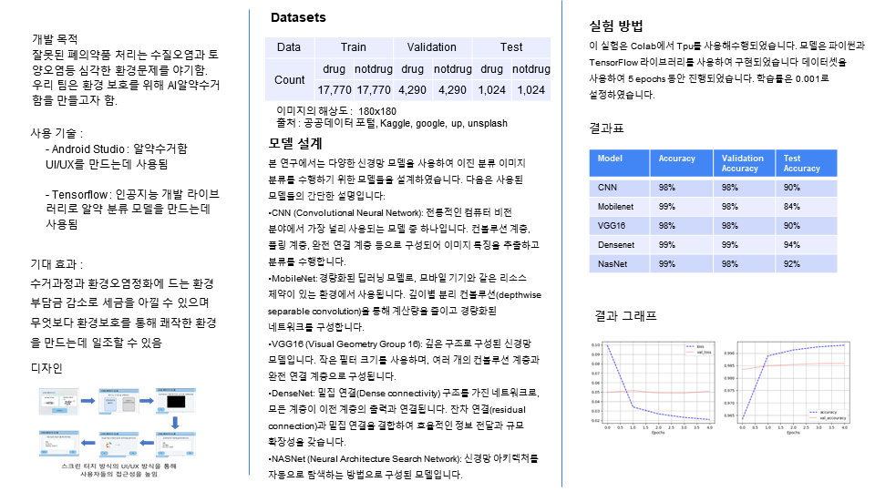
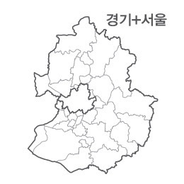

## 📊 자기 소개 (Introduction)

### 이름값하고 싶은 우수한입니다.

------

## 📊 직무 경험 (Experience)

**직무 타이틀** @ 나스미디어 데이터 디자인팀 (2023.07 - 2023.12)

------

## 📊 교육 (Education)
------
🏫 학교 이름 (시작연도 - 졸업연도)

- 한양대학교 ERICA
    - 광고홍보학과(2018 ~ 2024)
    - 신산업소프트웨어학과(2022 ~ 2024)

## 📊 보유 스킬 (Skill)
------
- Python : Pandas, Numpy, Matplotlib, Seaborn, Sklearn, Tensorflow
- Tableau
- SQL : mysql, postgresql

## 📊 프로젝트 (Project)
------

[딥러닝: 알약분류_CNN](code/알약분류/알약분류_CNN.ipynb)

- CNN 모델을 사용하여 알약인지 아닌지 판별하는 이진분류 모델을 만들었습니다.

[딥러닝: 알약분류_Densenet](code/알약분류/알약분류(densenet).ipynb)

- Densenet 모델을 사용하여 알약인지 아닌지 판별하는 이진분류 모델을 만들었습니다.

------

[서울과 경기도 인구수 변화 태블로 분석](https://public.tableau.com/shared/RG267R9T4?:display_count=n&:origin=viz_share_link)

- **출처 : 데이터시각적분석 태블로로 끝내기**

------

[Marketing Mix Modeling](code/MMM/lightweight_mmm.ipynb)

- MMM모델 중 구글에서 개발한 오픈소스인 Lightweight MMMM을 사용하여 MMM의 프로세스를 파악해봤습니다.

[MMM 참고자료](https://xlnt415.notion.site/Operationalizing-Modern-MMM-For-Your-Brand-2e01f5be7f834d16afece31deac0b8dc?pvs=4)

------

[SideProject : 인테리업과 새로운 가구유형과 특징 발견하기 - 현재 진행 중]
[Marketing Mix Modeling](code/side_project/인테리어와 새로운 가구.ipynb)
